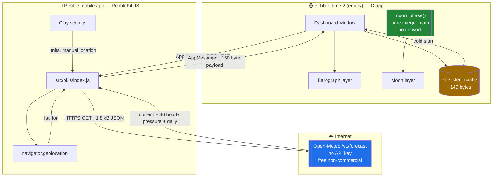
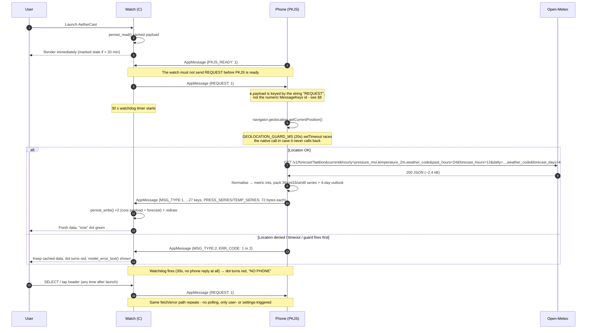
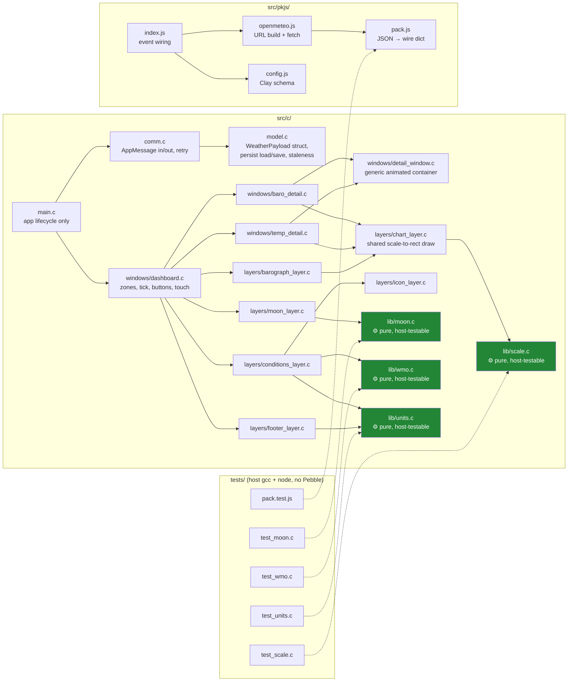
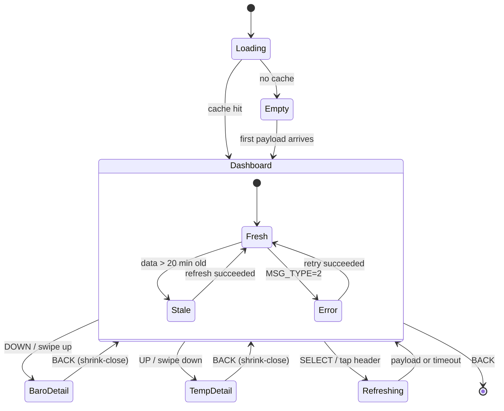
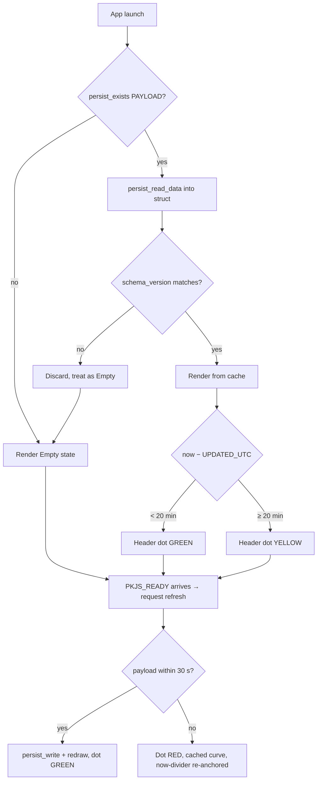

# AetherCast — Development Plan

A Pebble Time 2 watchapp showing current conditions, a **barometric pressure graph**
(24 h back + 12 h ahead), and a **minimalist moon phase disc**.

> Status: **M10 done — wire protocol v3 + animated detail screens, verified on
> both emulator and real hardware.** M1-M8 also done. M9 (publish to
> apps.repebble.com) not started. M10's code, host tests, docs, emulator
> screenshots (`docs/screenshots/m10-emery-*.png`) and a live real-device
> round trip on `emery` (Pebble Time 2, over the phone's Developer Connection)
> are all done — see §9 exit criteria for the two low-priority secondary-
> platform checks still open. A later fix stops an hours-old cache from being
> drawn as a live barograph: while a refresh is in flight and the cached
> now-divider is at least one hourly sample behind the clock, the plot zone
> shows an `UPDATING` placeholder; a failed refresh re-anchors that divider
> to the wall clock (see [docs/design/03-barograph.md](docs/design/03-barograph.md)).
> Every hardware/API claim below was verified against a live source on 2026-09-05.
> Sources are cached offline in [docs/vendor](docs/vendor) — see [docs/research/00-platform-findings.md](docs/research/00-platform-findings.md).

---

## 1. The one finding that shapes the whole design

**The Pebble Time 2 does not have a barometer.**

Pebble Time 2 (`emery` platform) sensors are: 6-axis IMU, heart rate, compass.
The barometer went into the *Pebble 2 Duo* (`flint`), not the Time 2.
(Verified: `docs/vendor/pebble-hardware-information.md`, plus Core Devices' own launch post.)

So "recent barometric data in my area" cannot come from the watch. It comes from a
weather model, fetched by the phone-side JS and pushed to the watch. This is
arguably *better* for the intended use — model MSL pressure is regionally
representative and lets us draw a **12-hour forward extension** of the trend, which
an on-wrist sensor could never do.

Practical consequence: the graph's past segment is drawn solid, the future segment
dotted, with a "now" divider. Honest and more useful.

---

## 2. Goals / non-goals

**Goals**
- One glanceable main screen: current conditions + barograph + moon.
- Pressure graph: 24 h history, 12 h forecast, auto-scaled, trend-coloured, 3 h delta.
- Moon phase: purely graphical disc, no text, computed on-watch, no network.
- Works offline from cache; shows staleness rather than a blank screen.
- No API key required by the user.

**Non-goals**
- Multi-day forecast browsing beyond a single secondary screen.
- Being a watchface. (Also: **touch is not supported in watchfaces** on PebbleOS —
  it is watchapp-only. See `docs/vendor/pebble-touch.md`.)
- Historical pressure beyond 24 h, radar, alerts, health data.

---

## 3. Target platform

| | |
|---|---|
| Primary platform | `emery` (Pebble Time 2) |
| Display | 200 × 228 px, 1.5", 64 colours, always-on e-paper |
| Input | 4 buttons **+ touchscreen** (`PBL_TOUCH`) |
| Backlight | RGB (`PBL_RGB_BACKLIGHT`) |
| Max app size | 128 kB (code + heap) |
| Max resource size | 256 kB |
| Persistent storage | 4 kB / app, 256 B per key (docs); Core Devices announced up to 1 MB — **design for 4 kB** |
| Toolchain | `pebble-tool` v5.0.40, SDK 4.33.1 (both verified installed/available on this Arch box) |

Secondary targets (best-effort, same code, no touch): `gabbro` (Pebble Round 2),
`basalt`, `chalk`, `diorite`, `flint`, `aplite`.

---

## 4. Architecture

### 4.1 Data flow



Key point: the watch never parses JSON. All parsing, unit-independent
normalisation, and downsampling happens in JS on the phone; the watch receives a
compact fixed-shape binary payload.

### 4.2 Refresh sequence




After that first exchange the watch only fetches again when the user asks:
`SELECT` (or a tap on the header) sends another `REQUEST`, and saving the Clay
settings page triggers one from the phone side. There is no background polling.

### 4.3 Module layout



The green modules are deliberately free of any `pebble.h` dependency so they
compile and run under plain `gcc` on this machine. That is how the moon maths and
graph scaling get tested without wearing the watch — see §8.

### 4.4 Screens



---

## 5. UI design

Main screen, Emery 200 × 228. Everything the user asked for is on one screen.

> Layout below is **variant B ("moon-prominent")**, chosen 2026-09-06 from four
> rendered candidates — see [docs/design/mockups](docs/design/mockups) and
> [docs/design/04-ui-layout.md](docs/design/04-ui-layout.md) for the alternatives
> and rationale.

```text
   x=0                                              x=200
y=0  ┌───────────────────────────────────────────────┐
     │  DENVER                          ●  4m        │  header 22 px
y=22 ├───────────────────────────────────────────────┤
     │                              ╭───────╮        │
     │   ☀        72°              │  ◗    │        │  current 76 px
     │       feels 70° · H81° L54° │       │        │
     │                              ╰───────╯        │
y=98 ├───────────────────────────────────────────────┤
     │ 1006.6 hPa                        FALLING ▼   │  baro label 18 px
y=116│  ·······································      │
     │         ╭──╮                   ┊              │
     │    ╭────╯  ╰───╮               ┊              │  plot 74 px
     │ ───╯           ╰────╌╌╌╌╌╌╌╌╌╌╌┊╌╌╌╌          │
     │  ·······································      │
y=190├───────────────────────────────────────────────┤
     │   ↖ 8 mph               46%                   │  footer 38 px
y=228└───────────────────────────────────────────────┘
        wind                     humidity
```

- Moon disc (r = 30, no text per spec) sits behind/beside the temperature in the
  conditions zone, not in the footer — it's a second focal point, not an
  afterthought. Footer carries only wind + humidity.
- Conditions zone drops to a single condensed "feels/hi/lo" sub-line to make
  room for the larger disc.
- **Solid** line = last 24 h. **Dotted** = next 12 h. `┊` = now.
- Trend colour, from the 3 h delta: falling fast → `GColorRed`, falling →
  `GColorOrange`, steady → `GColorLightGray`, rising → `GColorPictonBlue`,
  rising fast → `GColorBlueMoon`. On B/W platforms the past-segment line weight
  carries the same signal (1 px steady, 2 px otherwise).
- Header dot: green = fresh, yellow = stale, red = no phone / error.
- All coordinates derived from `layer_get_unobstructed_bounds()` and scaled by
  ratio, never hardcoded — so `gabbro` (260×260 round) and `basalt` (144×168) still work.

Details are in [docs/design/04-ui-layout.md](docs/design/04-ui-layout.md).

---

## 6. Data & protocol

### 6.1 Upstream request (verified working)

```
GET https://api.open-meteo.com/v1/forecast
  ?latitude={lat}&longitude={lon}
  &current=temperature_2m,apparent_temperature,relative_humidity_2m,is_day,
           weather_code,surface_pressure,pressure_msl,wind_speed_10m,wind_direction_10m
  &hourly=pressure_msl
  &daily=temperature_2m_max,temperature_2m_min,sunrise,sunset
  &past_hours=24&forecast_hours=12&past_days=1&forecast_days=2
  &timezone=auto&timeformat=unixtime
```

Smoke-tested live: returns **exactly 36 hourly samples**, ~1.8 kB, no API key.
Free tier is non-commercial, < 10 000 calls/day — this app fetches once per launch
plus whenever the user asks for a refresh, so it stays orders of magnitude under.

Bonus: `timezone` comes back as e.g. `America/Denver`, which gives a free location
label with zero extra requests and zero reverse-geocoding dependency.

### 6.2 Wire format

The whole payload is ~280 bytes across ~27 keys. Full key table in
[docs/design/01-data-protocol.md](docs/design/01-data-protocol.md). Summary:

| Key | Type | Notes |
|---|---|---|
| `MSG_TYPE` | uint8 | 1 = payload, 2 = error |
| `SCHEMA` | uint8 | 3 — bump to invalidate both on-watch persist caches |
| `UNIT_SYSTEM` | uint8 | 0 = imperial, 1 = metric (Clay) |
| `TEMP_C10`, `FEELS_C10`, `HI_C10`, `LO_C10` | int16 | tenths °C, always metric on the wire |
| `HUMIDITY` | uint8 | % |
| `WIND_KMH10` | int16 | tenths km/h |
| `WIND_DIR` | uint16 | degrees |
| `WX_CODE` | uint8 | WMO code |
| `IS_DAY` | uint8 | icon day/night variant |
| `PRESS_HPA10` | int16 | current, tenths hPa |
| `PRESS_SERIES` | bytes[72] | 36 × int16 LE, tenths hPa |
| `PRESS_NOW_IDX` | uint8 | 24 — index of the "now" divider |
| `PRESS_T0_UTC` | int32 | epoch of sample 0, shared by `TEMP_SERIES`/`WX_SERIES` |
| `TEMP_SERIES` | bytes[72] | 36 × int16 LE, tenths °C — hourly, feeds the temperature detail screen |
| `WX_SERIES` | bytes[36] | 36 × uint8, WMO code, same hourly grid |
| `DAILY_HI`, `DAILY_LO` | bytes[8] | 4 × int16 LE, tenths °C — today + 3-day outlook |
| `DAILY_CODE` | bytes[4] | 4 × uint8, WMO code — today + 3-day outlook |
| `DAILY_T0_UTC` | int32 | start-of-day epoch for outlook day 0 |
| `SUNRISE_UTC`, `SUNSET_UTC`, `UPDATED_UTC` | int32 | epoch |
| `LOC_NAME` | cstring ≤ 24 | derived from tz or Clay override |
| `LAT_SIGN` | int8 | for southern-hemisphere moon mirroring |

Design rules:
- **Wire is always metric integers.** Unit conversion happens on the watch, so
  changing units in settings never requires a network round-trip.
- Fixed-size series means the C side has zero dynamic allocation for graph data.
- Core weather fields and forecast fields (`TEMP_SERIES`/`WX_SERIES`/`DAILY_*`)
  persist under two separate keys (256 B/key limit — see §6.3), and a malformed
  forecast never invalidates the core payload or vice versa.
- `app_message_open(1024, 128)`.

### 6.3 Cache & staleness



The freshness threshold only colours the dot; the launch refresh is unconditional,
because the payload is small and the fetch happens on the phone.

A second threshold, `MODEL_GRAPH_MISLEADING_AFTER_S` (one hourly sample, 3600 s),
gates the barograph itself. While a refresh is in flight and the cached
now-divider would be a sample or more off, the plot is a loading placeholder
instead of the stale curve. If that refresh fails, the cached curve is shown
with the divider re-anchored to `(now − press_t0_utc) / 3600`, or with no
divider once the series no longer covers the present. See
[docs/design/03-barograph.md](docs/design/03-barograph.md).

Struct is ~140 bytes, comfortably under the documented 256-byte
`PERSIST_DATA_MAX_LENGTH`, in a single key. No paging needed.

---

## 7. Moon phase (on-watch, no network)

Pure integer maths using the SDK's `cos_lookup()`. Full derivation with worked
examples in [docs/design/02-moon-phase.md](docs/design/02-moon-phase.md).

```
age_s   = (now_utc − 947182440) mod 2551443      // epoch = new moon 2000-01-06 18:14 UTC
                                                  // synodic month = 29.530588853 d
phase   = age_s / 2551443                        // 0 = new, 0.5 = full
c       = cos(2π · phase)
lit_frac= (1 − c) / 2
```

Rendering, per scanline `y` of a disc of radius `r`:

```
half = isqrt(r² − y²)
waxing (phase < 0.5):  lit span = [ half·c , +half ]
waning (phase ≥ 0.5):  lit span = [ −half  , −half·c ]
```

Sanity checks that fall straight out of that: phase 0 → empty, 0.25 → right half,
0.5 → full, 0.75 → left half. Southern hemisphere mirrors the span (`LAT_SIGN`).

Cost: ~61 horizontal `graphics_draw_line` calls for the dashboard's `r = 30` disc
(variant B). Negligible.
Accuracy: ±~14 h worst case from ignoring orbital eccentricity — far better than
the "fuzzy accuracy is fine" bar.

---

## 8. Testing strategy

Learned the hard way elsewhere: when you cannot easily observe the target device,
put the maths somewhere a computer can check it.

1. **Host unit tests, no Pebble SDK.** `lib/moon.c`, `lib/scale.c`, `lib/wmo.c`,
   `lib/units.c` include `pebble.h` only behind `#ifdef PBL_SDK_3`; on the host,
   a tiny `tests/shim.h` supplies `cos_lookup`/`TRIG_MAX_*`. Run with
   `make -C tests && ./tests/run`. Assertions:
   - moon: known new/full moon dates → phase within ±0.02
   - moon: lit-fraction monotonic across a full synodic cycle
   - scale: flat series clamps to the minimum 8 hPa span; spiky series never
     produces y outside the plot rect; `scale_*_ex` variants (temperature's
     `SCALE_MIN_SPAN_TEMP` clamp, generic grid-step candidates) match the
     non-`_ex` wrappers bit-for-bit
   - units: °C↔°F and km/h↔mph rounding, including the −40 crossover
   - wmo: every documented code bucket, plus the overcast fallback
2. **JS unit tests.** `tests/pack.test.js` (Node, run via `NODE_PATH=tests/js node
   pack.test.js` or `make -C tests js`) asserts byte-exact wire dictionaries
   against `tests/fixtures/openmeteo-denver.json`: happy path (all v3 fields,
   correct lengths, `DAILY_T0_UTC`/`SUNRISE_UTC`/etc. passthrough with no offset
   math), all-null `hourly.temperature_2m` → `ERR_CODE 4`, missing
   `daily.weather_code` → `ERR_CODE 4`, and short daily arrays padding the
   outlook by repeating the last day. `make -C tests check` runs this alongside
   the C host suite.
3. **Synthetic payload injector.** `tools/fake_payload.js` emits rising / falling /
   flat / sawtooth / missing-data series so every graph branch can be exercised in
   the emulator without waiting for real weather.
4. **Emulator matrix.** `pebble install --emulator emery` primarily; then
   `gabbro`, `basalt`, `chalk`, `diorite` to catch hardcoded-layout regressions.
5. **On-wrist.** `pebble install --phone <ip>` / `pebble logs --phone <ip>` via
   the phone's Developer Connection. **Not optional for PKJS event-handler
   changes**: `FAKE_PAYLOAD_PRESET` (used for every emulator check above) sends
   payloads directly from PKJS and never exercises the real watch→`REQUEST`→
   phone-`appmessage`-received round trip. That gap hid a real bug at M10 —
   inbound `e.payload` is keyed by the symbolic key name (`"REQUEST"`), not the
   numeric `MessageKeys.X` id used for outbound dicts — that only a live
   round trip (or `pebble send-app-message` against a non-fake-preset build)
   could catch. `pebble ping --phone <ip>` confirms the Developer Connection
   transport itself before assuming the code is at fault.
6. **Screenshot diffing.** `pebble screenshot` into `docs/screenshots/` at each
   milestone; the diffs are the review artefact.

---

## 9. Milestones

```mermaid
gantt
    title AetherCast implementation order
    dateFormat X
    axisFormat %s
    section Foundation
    M0 Toolchain + SDK 4.33.1 + emery emulator    :m0, 0, 1
    M1 Project skeleton, dashboard window, layout :m1, after m0, 1
    section Data
    M2 PKJS + Open-Meteo + wire protocol          :m2, after m1, 2
    M3 Persistence, staleness, error states       :m3, after m2, 1
    section The point of the app
    M4 Barograph layer + auto-scale + trend       :m4, after m3, 2
    M5 Moon layer + host tests                    :m5, after m4, 1
    section Polish
    M6 Conditions zone, icons, units              :m6, after m5, 1
    M7 Clay settings + touch/gesture affordances  :m7, after m6, 1
    M8 Other platforms, battery pass, screenshots :m8, after m7, 1
    M9 Publish to apps.repebble.com               :m9, after m8, 1
    M10 Wire v3 + animated detail screens         :m10, after m9, 2
```



**M0 — environment** (only step with external prerequisites)

```bash
# Arch: SDK deps. Upstream documents Ubuntu/Fedora only; these are the Arch equivalents.
sudo pacman -S --needed nodejs npm sdl2-compat glib2 pixman zlib
# libsndio is AUR-only on Arch (`sndio`); if the emulator complains, install it or use CloudPebble.

pebble sdk install latest        # 4.33.1 ; pebble-tool v5.0.40 already installed
pebble install --emulator emery  # after M1
```

**M1 exit criteria:** `pebble build` clean for `emery`; dashboard window renders the
five zone rectangles at correct proportions on `emery`, `gabbro` and `basalt`.

**M4 exit criteria:** all five synthetic series from `tools/fake_payload.js` render
without clipping, with correct now-divider placement and dashed forecast segment.

**M5 exit criteria:** host test suite green; visual check of the 8 canonical phases.

**M6 exit criteria:** conditions zone shows a live icon (WMO code bucket, day/
night), temperature, feels/hi/lo, and the footer shows wind (direction +
speed) and humidity, in imperial units by default, verified against live data
and all nine icon buckets on `emery`.

**M7 exit criteria:** Clay config page (unit system radio group, manual
location toggle + lat/lon) opens via `showConfiguration`, saves via
`webviewclosed`, and a unit-system change is reflected on-watch (verified by
forcing `UNIT_SYSTEM=1` and confirming metric temp/wind/pressure render);
DOWN button and swipe-up both pushed the (now superseded, see M10) Details
window; UP button and swipe-down both pop back to the dashboard; SELECT and
tap-on-header both trigger a refresh; verified on `emery`, all seven
platforms build clean.

**M8 exit criteria:** all seven platforms build clean and were installed +
screenshotted in the emulator (`docs/screenshots/m8-<platform>-dashboard.png`);
basalt/aplite/diorite/flint show the full-height temperature with the feels/
hi/lo sub-line dropped and a legible (non-overlapping) `LECO_28_LIGHT_NUMBERS`
face, since `LECO_42_NUMBERS` doesn't fit their narrower conditions zone;
gabbro/chalk (round) show all five zones fully inside the bezel, including the
header/footer rows, via a vertical inset in addition to the existing
horizontal one; B/W platforms convey pressure trend via past-segment line
weight (steady = 1px, rising/falling = 2px) as well as the existing trend
word, with no reliance on hue; `prv_window_appear`/`prv_window_disappear`
subscribe/unsubscribe the minute tick timer and the model listener only while
the dashboard is the visible window (verified: pushing/popping Details
redraws the dashboard with current data, not stale); host test suite still
green.

**M10 exit criteria:** wire protocol bumped to `SCHEMA=3` (`TEMP_SERIES`,
`WX_SERIES`, `DAILY_HI`, `DAILY_LO`, `DAILY_CODE`, `DAILY_T0_UTC` added,
`pack.test.js` green for happy-path/missing-field/short-array-padding cases);
old plain-list Details window deleted; DOWN pushes an animated full-bleed
barograph detail (`baro_detail.c`), UP pushes an animated full-bleed
temperature + 4-day outlook detail (`temp_detail.c`), both built on the
generic `detail_window.c` grow/shrink container and neither showing the moon
glyph, per explicit instruction; both support UP/DOWN cursor scrub and
SELECT-to-snap-to-now; dashboard header shows `model_error_text()` per
`ERR_CODE` and a cycling refresh-in-progress indicator instead of just a red
dot; B/W platforms convey dashboard status via dot shape, not only colour;
host test suite (including new `scale_*_ex` cases) and `pack.test.js` both
green via `tests/Makefile`'s `check` target; all seven platforms build clean
with zero warnings; `docs/design/*.md` and this file updated to match.
Manual verification on `emery` (primary target): FAKE_PAYLOAD_PRESET
rising/falling/flat/sawtooth/missing, live ERR_CODE 0-4 force-test, baro/temp
detail + cursor scrub + back-to-dashboard all exercised in the emulator and
screenshotted to `docs/screenshots/m10-emery-*.png` — done. The dashboard's
compact barograph label (`barograph_layer.c`) gave the pressure value and
trend text an even 50/50 width split, which ellipsised two-digit-delta trend
text (e.g. `-12.0/3h FALLING FAST` on the `sawtooth` preset); fixed by giving
the trend field a 60/40 share instead, verified in the emulator and via
`tests/Makefile`'s `check` target. Still open (low priority, emery is the
only platform that matters to the user): gabbro/chalk bezel fit check,
aplite/diorite/flint B/W status-dot shape check.

**M10.1 — real-hardware verification (2026-09-07, `emery`/Pebble Time 2, done):**
side-loaded via `pebble install --phone <ip>` (Developer Connection over the
phone's Wi-Fi↔BLE bridge). This surfaced a bug the emulator never could:
`src/pkjs/index.js`'s `appmessage` handler read
`e.payload[MessageKeys.REQUEST]`, but a real device's PebbleKit JS keys
inbound `e.payload` by the **symbolic key name** (`"REQUEST"`), not the
numeric `MessageKeys.X` id used for outbound dicts — so the check always
missed, `fetchAndSend()` never ran, and the watch's 30 s watchdog fired every
launch with a misleading "NO PHONE". Every prior manual check had used
`FAKE_PAYLOAD_PRESET`, which sends straight from PKJS and never exercises the
real watch→`REQUEST`→phone-`appmessage` round trip, so this path had no
coverage until now. Fixed by reading `e.payload.REQUEST` instead; confirmed
live via `pebble logs --phone <ip>` showing a stored payload
(`loc=DENVER temp=26.8 press=1003.9`) and a screenshot of a fully populated
dashboard. Also added a `GEOLOCATION_GUARD_MS` (20 s) JS-side `setTimeout`
around `navigator.geolocation.getCurrentPosition()` in `fetchAndSend()`, as a
belt-and-suspenders since real-device PebbleKit JS geolocation is not
guaranteed to honour its own native `timeout` option and can otherwise hang
silently past the watch's 30 s watchdog with no `ERR_CODE` at all.

---

## 10. Risks & decisions

| Risk | Impact | Mitigation |
|---|---|---|
| PT2 has no barometer | Core feature can't use local sensor | Model MSL pressure from Open-Meteo; gains a 12 h forecast segment the sensor never could. Documented honestly in-app. |
| `past_hours` + `daily` interaction undocumented | Wrong sample count | Already smoke-tested live: exactly 36 samples. Defensive: JS pads/truncates to 36 and forward-fills nulls. |
| Open-Meteo free tier limits / outage | No data | Fetches only on launch and on explicit user refresh — no polling, so call volume stays far below the 10 000/day limit; cache-first render; a stale/error dot never blanks the screen. |
| Persistent storage limit ambiguity (docs 4 kB, blog 1 MB) | Write failure | Design to 4 kB / 256 B-per-key. Payload is ~140 B. |
| Geolocation permission denied | No location | Clay manual lat/lon override; last known location persisted in JS `localStorage`. |
| Real-device PebbleKit JS geolocation ignoring its native `timeout` | Silent hang past the watch's 30 s watchdog, generic "NO PHONE" instead of a real `ERR_CODE` | JS-side `GEOLOCATION_GUARD_MS` (20 s) `setTimeout` in `fetchAndSend()` wins if the native callback never fires at all; sends `ERR_CODE 2` (no fix) instead. |
| 64-colour e-paper contrast | Unreadable graph | Restrict to a checked palette; verify every zone on the real device at M8; monochrome fallback path is the same code with `PBL_IF_COLOR_ELSE`. |
| Touch unavailable in watchfaces | Blocks a future watchface variant | Ship as watchapp now; if a watchface is wanted later it must be button-only. Touch is strictly an enhancement, never the only path to any action. |
| Emulator on Arch (unsupported distro) | Can't iterate locally | Package mapping above; CloudPebble as documented fallback. |

---

## 11. Repository layout

```
pebble-aethercast/
├─ PLAN.md                     ← this file
├─ README.md
├─ package.json                (M1, via `pebble new-project`)
├─ wscript                     (M1)
├─ src/
│  ├─ c/
│  │  ├─ main.c  comm.c  model.c  wire.h
│  │  ├─ windows/   dashboard.c  detail_window.c  baro_detail.c  temp_detail.c
│  │  ├─ layers/    chart_layer.c  barograph_layer.c  moon_layer.c  conditions_layer.c
│  │  │             icon_layer.c  footer_layer.c
│  │  └─ lib/       moon.c  scale.c  wmo.c  units.c   ← host-testable, no pebble.h
│  └─ pkjs/         index.js  openmeteo.js  pack.js  config.js
├─ tests/           Makefile  shim.h  test_main.c  js/message_keys.js  fixtures/
│                   test_moon.c  test_scale.c  test_units.c  test_wmo.c  pack.test.js
├─ tools/
│  ├─ fetch-docs.sh            ← refreshes docs/vendor (already working)
│  └─ fake_payload.js          (M4)
└─ docs/
   ├─ research/00-platform-findings.md
   ├─ design/01-data-protocol.md
   ├─ design/02-moon-phase.md
   ├─ design/03-barograph.md
   ├─ design/04-ui-layout.md
   ├─ vendor/                  ← 43 upstream pages, offline Markdown
   ├─ reference/               ← shallow clones of official example apps
   └─ screenshots/
```

---

## 12. References

Everything below is mirrored offline in `docs/vendor/`; re-fetch with `./tools/fetch-docs.sh`.

- Pebble SDK install — <https://developer.repebble.com/sdk/>
- Hardware information (platform matrix) — <https://developer.repebble.com/guides/tools-and-resources/hardware-information/>
- Building for every Pebble (defines/macros) — <https://developer.repebble.com/guides/best-practices/building-for-every-pebble/>
- Touch & gesture recognizers — <https://developer.repebble.com/guides/events-and-services/touch/>
- Persistent storage — <https://developer.repebble.com/guides/events-and-services/persistent-storage/>
- Sending and receiving data (AppMessage) — <https://developer.repebble.com/guides/communication/sending-and-receiving-data/>
- PebbleKit JS — <https://developer.repebble.com/guides/communication/using-pebblekit-js/>
- Watchface tutorial part 3 (web content) — <https://developer.repebble.com/tutorials/watchface-tutorial/part3/>
- Open-Meteo Forecast API — <https://open-meteo.com/en/docs>
- Core Devices launch specs — <https://ericmigi.com/blog/introducing-two-new-pebbleos-watches>
- Aug 2026 SDK update (touch, gestures, storage) — <https://repebble.com/blog/new-pebble-weather-app-software-updates>
