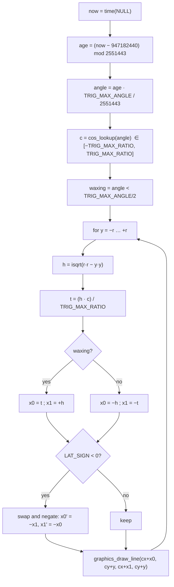

# Moon phase rendering

Requirement: *"a minimalist representation of the current moon phase (fuzzy accuracy
is fine; no need for any text in this part)"*.

So: a disc, drawn on the watch, no network, no text, no resources.

## Phase from the clock

Mean synodic month approximation:

$$
\text{age} = \left( t_{\text{now}} - t_{0} \right) \bmod T_{\text{syn}}
\qquad
\phi = \frac{\text{age}}{T_{\text{syn}}}
$$

| Constant | Value | Meaning |
|---|---|---|
| $t_0$ | `947182440` | 2000-01-06 18:14 UTC, a new moon |
| $T_{\text{syn}}$ | `2551443` s | 29.530588853 days |

$\phi = 0$ new, $0.25$ first quarter, $0.5$ full, $0.75$ last quarter.

Illuminated fraction:

$$
c = \cos(2\pi\phi) \qquad f_{\text{lit}} = \frac{1 - c}{2}
$$

Check: $\phi=0 \Rightarrow c=1 \Rightarrow f=0$ (new).
$\phi=0.5 \Rightarrow c=-1 \Rightarrow f=1$ (full).
$\phi=0.25 \Rightarrow c=0 \Rightarrow f=0.5$ (half). Good.

### Accuracy

Ignoring orbital eccentricity costs up to about ±14 hours of phase timing, i.e.
±0.02 in $\phi$ — visually about one pixel of terminator position on a 32 px disc.
Well inside "fuzzy accuracy is fine". Not worth the code size of a full ELP series.

## Drawing the terminator

The terminator is the projection of a circle onto the disc, so on every horizontal
scanline it is a single point. That makes this a scanline fill, not a path.

For a disc of radius $r$ centred at the origin, at scanline $y \in [-r, r]$:

$$
h = \left\lfloor \sqrt{r^2 - y^2} \right\rfloor
$$

$$
\text{lit span} =
\begin{cases}
[\; h\,c,\; +h \;] & \phi < 0.5 \quad \text{(waxing, lit on the right)} \\[4pt]
[\; -h,\; -h\,c \;] & \phi \geq 0.5 \quad \text{(waning, lit on the left)}
\end{cases}
$$

Walk through it:

| $\phi$ | $c$ | waxing span | waning span | Result |
|---|---|---|---|---|
| →0 | 1 | $[h, h]$ | — | empty ✓ new |
| 0.25 | 0 | $[0, h]$ | — | right half ✓ |
| →0.5⁻ | −1 | $[-h, h]$ | — | full ✓ |
| →0.5⁺ | −1 | — | $[-h, h]$ | full ✓ |
| 0.75 | 0 | — | $[-h, 0]$ | left half ✓ |
| →1 | 1 | — | $[-h, -h]$ | empty ✓ new |

Continuous at every boundary, and both extremes degenerate to zero width rather
than to a glitch. No special-casing needed.

### Southern hemisphere

South of the equator the moon appears rotated 180°, so the lit side flips. `LAT_SIGN`
comes down in the payload; when it is negative, negate the span endpoints and swap
them. One line, and it makes the app correct for half the planet.

## Algorithm



All integer. `cos_lookup()` and `TRIG_MAX_ANGLE` / `TRIG_MAX_RATIO` come from the
SDK; `lib/moon.c` includes `pebble.h` only under `#ifdef PBL_SDK_3`, and on the
host `tests/shim.h` supplies equivalents so it builds under plain `gcc`.

## Visual treatment

- Disc radius is derived from the conditions zone, not hardcoded: `r = zone.h * 2/5`
  (≈ 30 px on `emery`), clamped to a fixed `r = 12` on the 144 × 168 "compact"
  platforms whose zone is too short for a large disc. Centre sits at 4/5 of the
  zone width, beside the temperature.
- Dark side: `GColorOxfordBlue` — visible against the background so a new moon
  still reads as "a moon", not as "nothing rendered". `GColorBlack` on B/W.
- Lit side: `GColorPastelYellow` on colour platforms, `GColorWhite` on B/W.
- 1 px outline in the dark colour, so the silhouette is always defined.
- No text, no percentage, no label. As requested.

```
   new        crescent      first Q        gibbous        full
   ●            ◗             ◐             ◕             ○
 (outline)   (thin lit)   (right half)  (mostly lit)   (all lit)
```

## Cost

Dashboard disc is $r = 30$ (variant B, see [04-ui-layout.md](04-ui-layout.md)) →
61 scanlines → 61 `graphics_draw_line()` calls plus one `graphics_fill_circle()`
and one `graphics_draw_circle()`.
Once per minute at most (phase moves ~0.0002 per minute; redrawing more often
than the tick handler is pointless). Immaterial even at this size; smaller
platforms (e.g. `basalt`, $r = 12$) cost proportionally less.

## Tests (`tests/test_moon.c`, host gcc, no watch needed)

1. Known new moons and full moons from a published ephemeris → computed $\phi$
   within ±0.02 of 0.0 / 0.5.
2. $f_{\text{lit}}$ is monotonically increasing over $\phi \in [0, 0.5]$ and
   monotonically decreasing over $[0.5, 1]$, sampled at 1000 points.
3. Span width equals 0 at $\phi = 0$ and $2h$ at $\phi = 0.5$, for every $y$.
4. Waxing and waning spans agree at the $\phi = 0.5$ boundary.
5. `LAT_SIGN = −1` output is the exact mirror of `LAT_SIGN = +1`.
6. No span endpoint ever falls outside $[-r, r]$, swept across all $\phi$ and $y$.

Test 6 exists because an off-by-one in `isqrt` is exactly the kind of bug that
would only show up as one stray pixel on a device I cannot easily inspect.
