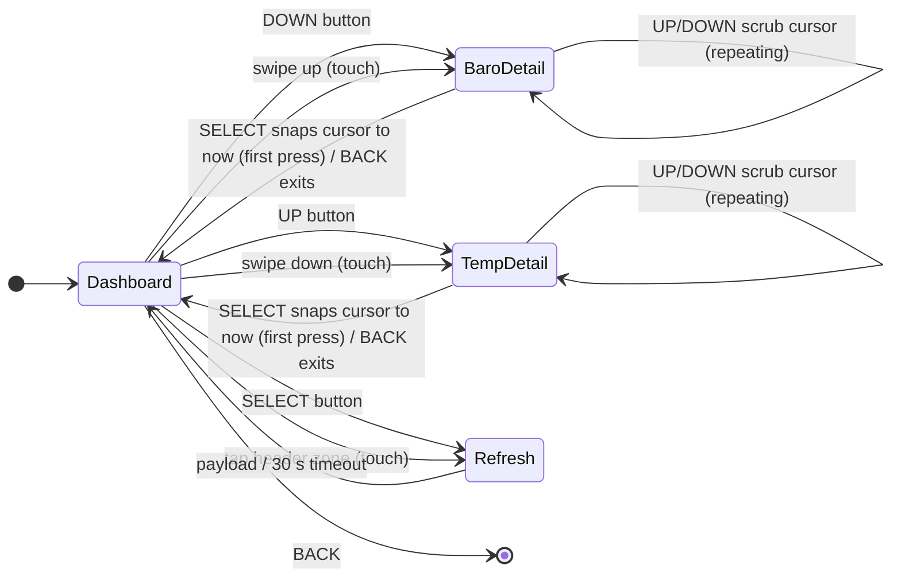

# UI layout

## Dashboard — `emery` (200 × 228)

> **Chosen layout: variant B ("moon-prominent")**, selected 2026-09-06 from four
> rendered candidates in [mockups/](mockups/):
> [A — baseline](mockups/dashboard-a-baseline.png),
> [B — moon-prominent](mockups/dashboard-b-moon-prominent.png) ✅,
> [C — graph-dominant](mockups/dashboard-c-graph-dominant.png),
> [D — trend banner](mockups/dashboard-d-trend-banner.png).
> Re-render with `python3 tools/render_mockups.py` after any layout tweak.

```text
   x=0        40        80       120       160    x=200
y=0  ┌───────────────────────────────────────────────┐
     │ DENVER                            ●  4m       │  header      22 px
y=22 ├───────────────────────────────────────────────┤
     │                               ╭──────────╮    │
     │   ☀        72°               │    ◗     │    │
     │                               │          │    │  conditions  76 px
     │       feels 70° · H81° L54°  ╰──────────╯    │
     │                                                │
y=98 ├───────────────────────────────────────────────┤
     │ 1006.6 hPa                        FALLING ▼   │  baro label  18 px
y=116├ · · · · · · · · · · · · · · · · · · · · · · · ┤
     │            ╭──╮                  ┃            │
     │      ╭─────╯  ╰────╮             ┃            │  plot        74 px
     │ ·····╯·············╰───╌╌╌╌╌╌╌╌╌╌┃╌╌╌╌╌╌·······│
     │                                  ┃            │
y=190├───────────────────────────────────────────────┤
     │   ↖ 8 mph                    46%               │  footer     38 px
y=228└───────────────────────────────────────────────┘

Moon disc r=30, centre ≈ (158, 60) — anchored in the conditions zone
beside the temperature, not the footer. No text on the disc, per spec.
```

Zone table:

| Zone | y range | Height | Fraction of screen |
|---|---|---|---|
| header | 0 – 22 | 22 | 9.6 % |
| conditions | 22 – 98 | 76 | 33.3 % |
| baro label | 98 – 116 | 18 | 7.9 % |
| plot | 116 – 190 | 74 | 32.5 % |
| footer | 190 – 228 | 38 | 16.7 % |

Rationale vs. the other candidates: the plan's own goal calls the moon a "quiet
second signal", which argues for the small-disc-in-footer baseline (variant A).
Variant B was chosen anyway to give the moon equal visual weight to the current
temperature — accepted trade-off, revisit if it reads as competing for attention
once built and worn.

## Scaling to other platforms

**Nothing is hardcoded.** All zone heights are computed as fractions of
`layer_get_unobstructed_bounds(window_get_root_layer(window))`, per the SDK's
"Avoid Hardcoded Layout Values" guidance.

```c
GRect b = layer_get_unobstructed_bounds(root);
int16_t y = 0;
GRect header = zone(b, &y, 96);      // per-mille of height
GRect cond   = zone(b, &y, 333);
GRect blabel = zone(b, &y, 79);
GRect plot   = zone(b, &y, 325);
GRect footer = zone(b, &y, 167);
```

| Platform | Size | Notes |
|---|---|---|
| `emery` (PT2) | 200 × 228 | reference design |
| `gabbro` (Round 2) | 260 × 260 round | inset all four sides by 14 px — the header/footer rows sit where the chord is narrowest, so a horizontal inset alone is not enough; plot rect inset a further 8 px so the curve stays inside the circle |
| `basalt` | 144 × 168 | "compact": drop the "feels like"/hi-lo lines, temperature gets the full zone height; moon disc r = 12 |
| `chalk` | 180 × 180 round | same 14 px inset as `gabbro`; the narrower result trips the `LECO_28_LIGHT_NUMBERS` fallback below |
| `diorite`, `flint`, `aplite` | 144 × 168 B/W | `PBL_IF_COLOR_ELSE` for every colour; trend conveyed by the past-segment line weight (1 px steady, 2 px rising/falling) plus the trend word |

The compact/full split is decided from the raw screen height (`<= 168`) before the
round inset is applied, not from a platform macro, so any future 168-tall platform
is handled automatically. Use `PBL_IF_ROUND_ELSE()` for the insets rather than a
separate code path.

## Colour palette (64-colour e-paper)

| Element | Colour | B/W fallback |
|---|---|---|
| Background | `GColorBlack` | `GColorBlack` |
| Primary text | `GColorWhite` | `GColorWhite` |
| Secondary text | `GColorLightGray` | `GColorWhite` |
| Grid | `GColorDarkGray` | `GColorWhite` (dotted) |
| Pressure falling | `GColorOrange` / `GColorRed` | `GColorWhite` 2 px |
| Pressure rising | `GColorPictonBlue` / `GColorBlueMoon` | `GColorWhite` 2 px |
| Pressure steady | `GColorLightGray` | `GColorWhite` 1 px |
| Now divider | `GColorWhite` | `GColorWhite` |
| Moon lit | `GColorPastelYellow` | `GColorWhite` |
| Moon dark | `GColorOxfordBlue` | `GColorBlack` + outline |
| Fresh / stale / error dot | `GColorGreen` / `GColorYellow` / `GColorRed` | — |

The status dot is a single filled circle whose colour carries the whole signal on
colour platforms. On 1-bit platforms (`aplite`/`diorite`/`flint`) colour can't
carry it, so the dot's fill pattern does instead: solid (fresh), half-filled
(stale), hollow/outline-only (error) - see `dashboard.c`'s `prv_draw_status_dot()`.
The age readout (`4m` / `--`) next to it, or the red `model_error_text()` string
in place of it during an error, is the redundant non-colour cue on every platform.

Contrast on a reflective e-paper display is not the same as on a monitor. Every
combination above gets checked on the physical watch at M8, and the palette table
is the single place to change if something washes out.

## Typography

| Element | Font |
|---|---|
| Temperature | `FONT_KEY_LECO_42_NUMBERS`, falling back to `FONT_KEY_LECO_28_LIGHT_NUMBERS` when the available width is under 70 px (`basalt` et al. and `chalk`) |
| Location | `FONT_KEY_GOTHIC_18_BOLD` |
| Wind, humidity | `FONT_KEY_GOTHIC_18` |
| Feels/hi/lo, pressure value, trend word, age | `FONT_KEY_GOTHIC_14` |
| Detail screen titles | `FONT_KEY_GOTHIC_18_BOLD` |
| Detail screen cursor readout, deltas, outlook day/hi-lo | `FONT_KEY_GOTHIC_14` / `FONT_KEY_GOTHIC_18` |

System fonts only for v1 — no custom font resource, which keeps the bundle small
and sidesteps per-platform font metric surprises. Revisit only if the layout
demands it.

## Input



Button map:

| Window | UP | SELECT | DOWN | BACK |
|---|---|---|---|---|
| Dashboard | push temperature detail | request refresh | push barograph detail | exit app (system default) |
| Barograph/temperature detail | scrub cursor back, repeating at 150 ms | snap cursor to "now" | scrub cursor forward, repeating at 150 ms | shrink-close back to Dashboard |

Rules:

- **Every action is reachable with buttons alone.** Touch is additive. PebbleOS is
  button-first and the user may have disabled touch entirely in Settings → Display.
- Guard all touch setup with `touch_service_is_enabled()`; it returns `false` both
  for "no hardware" and "user turned it off". It is checked in the window's `load`
  handler, and the whole touch block is compiled out with `#if defined(PBL_TOUCH)`
  — only `emery` and `gabbro` define it, and the recognizer API is a no-op stub
  elsewhere.
- Use gesture recognizers, not the raw touch stream:
  `tap_recognizer_create()` for the header, `swipe_recognizer_create()` for
  vertical navigation (one recognizer per direction, since each is bound to a
  single `SwipeDirection`). Attach with `window_attach_recognizer()` — the window
  owns and frees them, so they live for the window's lifetime rather than being
  attached and detached per appearance.
- Call `window_set_touch_bridge_disabled(window, true)`, otherwise the system
  swallows touches before the recognizers see them.
- What *is* scoped to visibility is the redraw machinery: the dashboard subscribes
  the minute tick timer and the model listener in `appear` and drops both in
  `disappear` (also cancelling the refresh-indicator `AppTimer` if one is running),
  so nothing ticks while a detail screen is on top. On a watch rated for 30
  days, leaving a per-minute redraw running behind another window is a real cost.

## Detail screens

DOWN pushes an expanded, full-bleed **barograph detail** (`windows/baro_detail.c`);
UP pushes an expanded, full-bleed **temperature + forecast detail**
(`windows/temp_detail.c`). Both are built on a shared generic container,
`windows/detail_window.c`, rather than the old plain scrollable list — see
PLAN.md's module diagram for how the pieces fit together.

### Grow/shrink transition

`detail_window_push()` takes a `DetailSpec` whose `from_rect` is the dashboard
zone the button/swipe corresponds to (the combined pressure-label+plot rect for
barograph, the conditions rect for temperature — cached each dashboard redraw as
`s_zone_baro`/`s_zone_conditions`). The window's single content `Layer` starts at
`from_rect` and is animated to the full screen bounds via
`property_animation_create_layer_frame()`, `AnimationCurveEaseOut`, 250 ms. Because
the content layer's own draw callback always renders into *whatever its current
bounds are* (via `chart_layer_draw()`'s scale-to-rect maths), the chart visibly
grows out of the dashboard zone frame-by-frame with no separate masking or
cross-fade needed. BACK reverses the same animation (full bounds → `from_rect`)
and removes the window from the stack only once the shrink finishes
(`animation_set_handlers`' `.stopped` callback), so the window is never popped out
from under a still-visible in-flight animation.

### Barograph detail

Title ("PRESSURE") and a cursor readout (time + hPa value) share the top row; the
chart (`chart_layer_draw`, trend-coloured, same rendering code as the dashboard's
compact plot) fills the middle; a 3 h/6 h/12 h delta row sits below it; a footer
repeats the licence-required Open-Meteo attribution (moved here from the old
Details screen — see `docs/vendor/openmeteo-terms.md`). No moon glyph.

### Temperature detail

Same title/cursor-readout layout, an orange hourly temperature chart with
sunrise/sunset tick marks, and a 4-day outlook strip below it (day-of-week label,
`icon_layer_draw()` WMO icon, high/low). No moon glyph — the dashboard's
conditions zone already shows it, and it isn't relevant to a temperature-focused
screen.

### Scrub cursor

Both detail screens track an internal `s_cursor_idx` (module-static, one detail
window open at a time): `-1` means "follow now" (auto-tracks `press_now_idx` as
the model refreshes), any other value freezes the cursor there. UP/DOWN move it
by one hourly sample (repeating click, 150 ms) and redraw via
`detail_window_mark_dirty()`; SELECT resets it to `-1`. Since detail windows own
BACK for the shrink-close animation, there's no page-scroll — the whole 36-sample
series fits on screen at once, unlike the old row-per-hour scrollable list.
